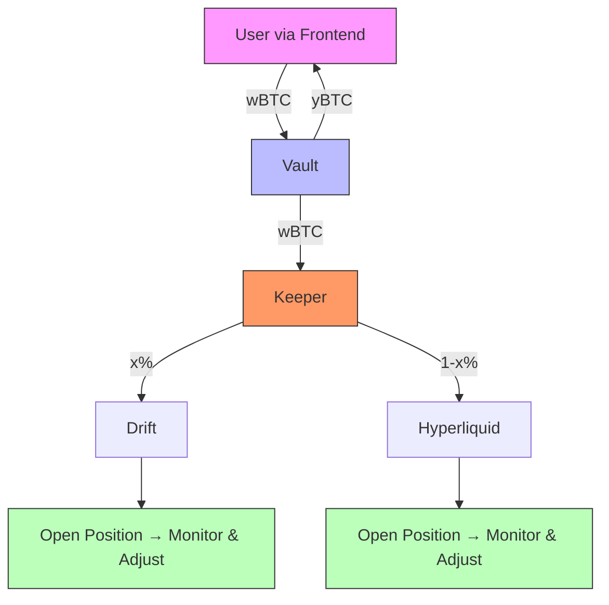

```mermaid
flowchart TD
    User[User via Frontend] -->|wBTC| Vault
    Vault -->|yBTC| User
    Vault -->|wBTC| Keeper

    Keeper -->|x%| Drift[Drift]
    Keeper -->|1-x%| HL[Hyperliquid]

    Drift --> DriftProcess[Open Position → Monitor & Adjust]
    HL --> HLProcess[Open Position → Monitor & Adjust]

    style User fill:#f9f,stroke:#333,stroke-width:1px
    style Vault fill:#bbf,stroke:#333,stroke-width:1px
    style Keeper fill:#f96,stroke:#333,stroke-width:1px
    style DriftProcess fill:#bfb,stroke:#333,stroke-width:1px
    style HLProcess fill:#bfb,stroke:#333,stroke-width:1px

```
