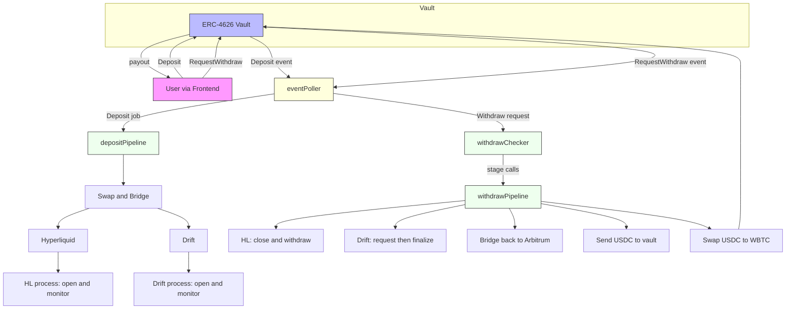

# Keeper Backend

This backend service automates flows after deposits into an **ERC-4626 vault** on Arbitrum.  
It listens for `Deposit` and `RequestWithdraw` events, then runs a **pipeline** to swap, bridge, deposit, and open/close positions on **Drift** and **Hyperliquid**.

A second **withdraw pipeline** orchestrates the reverse flow.

---



<sub>Note: Mermaid can be picky with Unicode arrows and parentheses in node labels. This version uses ASCII-only labels.</sub>

---

## 🔄 Poller changes

- **eventPoller.js** _(replaces `depositPoller.js`)_  
  Unified on-chain listener that subscribes to vault events and enqueues jobs:
  - **`Deposit`** → enqueues a **deposit job** handled by the **deposit pipeline** (swap → bridge → HL/Drift).
  - **`RequestWithdraw`** → records a withdrawal request for the **withdraw checker** to time and advance.
  - (Optional) **`FinalizeWithdraw` / `Withdraw`** → marks requests complete and clears local state.

Why? → One poller = fewer race conditions and one source of truth for job queue + deduping.

---

## 🧵 Withdrawal system (new)

The withdrawal flow is now composed of three moving parts:

1. **withdrawPipeline.js** — _stage orchestrator_  
   Reverses deposit allocation, step by step:

   - `--stage=close-hl` Close HL positions, free USDC.
   - `--stage=drift-request` Request Drift withdrawal.
   - `--stage=drift-finalize` Finalize Drift withdrawal after cooldown.
   - `--stage=withdraw-hl` Withdraw free USDC from HL.
   - `--stage=bridge-solana` Bridge Solana to Arbitrum USDC.
   - `--stage=send-to-vault` Send USDC back to the vault.
   - `--stage=swap-wbtc` Swap USDC to WBTC, complete payout.

   Each stage logs a **reqId** and writes progress to `withdraw_state.json`.

2. **withdrawChecker.js** — _timer/logic brain_

   - Watches pending withdrawal requests from `eventPoller`.
   - Tracks cooldowns (`cooldownTime`).
   - Updates `withdraw_state.json` so requests resume safely.
   - Calls `withdrawPipeline.js` with the correct stage when eligible.

3. **withdrawRunner.js** — _process supervisor_
   - Runs the **checker** in production, restarts on crash.
   - Surfaces logs to console/files.
   - Keeps a backlog so no request is lost if RPC hiccups.

Local state:

- **`withdraw_state.json`** → `{ reqId → { status, nextStage, lastSeen, ... } }`

---

## 🧩 Components

- **index.js** — Entry; bootstraps provider, ABIs, logger, queues; starts `eventPoller`.
- **eventPoller.js** — Replaces `depositPoller.js`. Subscribes to vault events (`Deposit`, `RequestWithdraw`, …) and routes jobs.
- **depositPipeline.js** — Swap → Bridge → HL/Drift allocation after deposits.
- **withdrawPipeline.js** — Stage-based reverse flow for withdrawals.
- **withdrawChecker.js** — Schedules and advances withdrawal requests through pipeline stages.
- **withdrawRunner.js** — Keeps the checker alive (production supervisor).
- **rebalance.js** — `checkAndMaybeRebalance()` helper.
- **python_runner.js** — Runs HL Python utilities with JSON I/O.
- **send_usdc.js** — Arbitrum USDC transfer helper.
- **logger.js** — Console + daily rotate.

---

## 🧪 How to run

**Keeper (deposits + monitoring):**

```bash
node index.js
```

**Withdrawal supervisor (checker + pipeline):**

```bash
node withdrawRunner.js
```

**Manual debug of one stage:**

```bash
node withdrawPipeline.js --stage=drift-finalize --reqId=req_1234567890
```

> In production: run `server.js`, `index.js`, and `withdrawRunner.js` as separate long-running processes (e.g. with pm2 or systemd).

---
