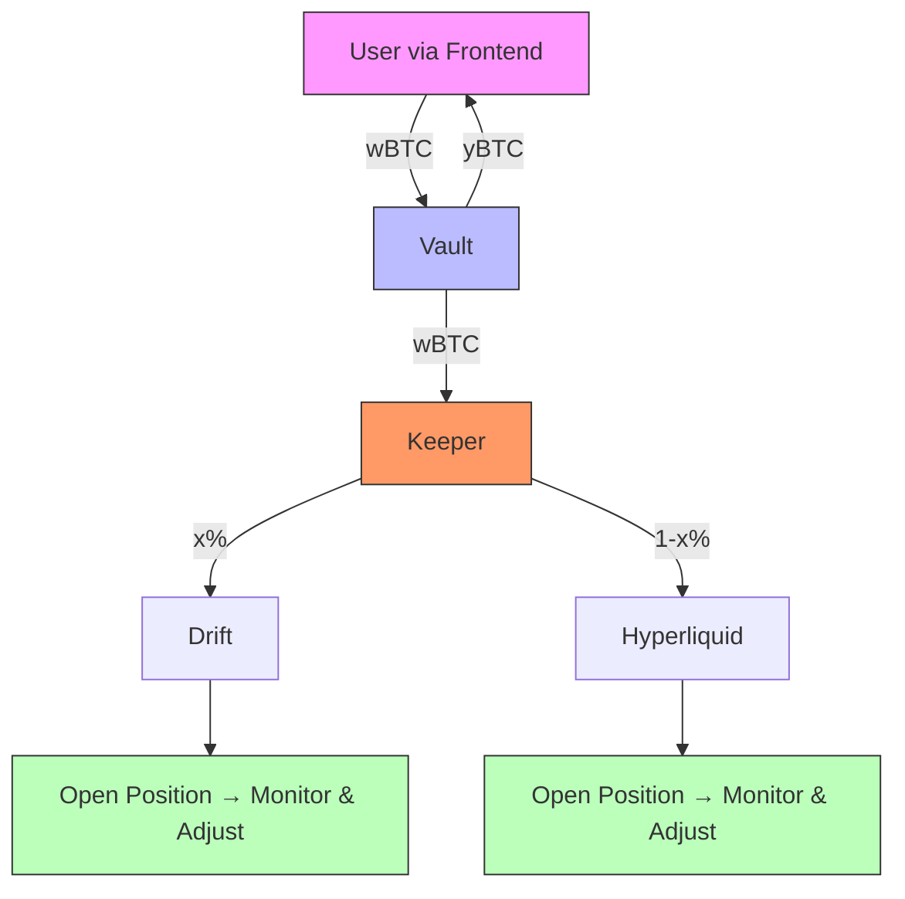

# Keeper Backend

This backend service automates flows after deposits into an **ERC-4626 vault** on Arbitrum.  
It listens for `Deposit` events, then runs a **pipeline** to swap, bridge, deposit, and open positions on **Drift** and **Hyperliquid**.

A second **withdraw pipeline** orchestrates the reverse flow.

---



## ✨ Components

- **index.js** — Entry point.
  - Connects to Arbitrum via ethers provider.
  - Loads vault ABI + WBTC/USDC ERC20 contracts.
  - Starts the deposit poller and pipeline queue.
  - Schedules rebalances and monitors HL/Drift snapshots.
- **depositPoller.js** — Polls chain logs for `Deposit(address,address,uint256,uint256)`.  
  Uses block ranges with reorg buffer instead of ephemeral filters.
- **depositPipeline.js** — Orchestrates the full flow after a vault deposit:
  1. Detect WBTC arrival.
  2. Swap WBTC → USDC (90%).
  3. Bridge 85% of A’s USDC to Solana.
  4. Deposit B’s USDC to Hyperliquid and open order.
  5. Deposit Solana USDC to Drift vault.
- **withdrawPipeline.js** — Multi-stage CLI for reversing allocations:
  - Step 1: Close Hyperliquid positions.
  - Step 2/3: Request + finalize Drift withdraw.
  - Step 4: Withdraw USDC from Hyperliquid.
  - Step 5: Bridge Solana → Arbitrum.
  - Step 6/7: Send USDC A/B to vault.
  - Step 8: Swap USDC → WBTC.
- **rebalance.js** — Builds `checkAndMaybeRebalance()`, ensuring vault asset balances meet `rebalanceMin` before calling `rebalance()`.
- **python_runner.js** — Wrapper for running Python HL scripts (`create_orders.py`) with UTF-8 enforced and JSON output parsing.
- **send_usdc.js** — Helper to send USDC on Arbitrum from one wallet to another.
- **logger.js** — Winston logger with console + daily rotating file transports.

---

## 📦 Dependencies

- Node.js 18+
- Packages:
  ```bash
  npm install ethers dotenv winston winston-daily-rotate-file @solana/web3.js @solana/spl-token
  ```
- Python 3 (for Hyperliquid scripts).

---

## 🌐 Environment Variables (`.env`)

Example:

```ini
# Arbitrum
ARBITRUM_ALCHEMY_MAINNET=https://arb-mainnet.g.alchemy.com/v2/your-key
KEEPER_MAINNET_PRIVATE_KEY=0x...

# Vault + tokens
VAULT_ADDRESS=0x...
WBTC_ADDRESS=0x...
USDC_ADDRESS=0x...

# Recipients
WALLET_RECIPIENT_A=0x...
WALLET_RECIPIENT_B=0x...
PK_RECIPIENT_A=0x...
PK_RECIPIENT_B=0x...

# Solana
SOLANA_RPC=https://api.mainnet-beta.solana.com
SOLANA_PUBKEY=YourSolanaPubkey
SOLANA_USDC_MINT=EPjFWdd5AufqSSqeM2qN1xzybapC8G4wEGGkZwyTDt1v

# Keeper settings
CONFIRMATIONS=2
EVENT_POLL_MS=4000
REBALANCE_DEBOUNCE_MS=30000
LOG_DIR=./logs
LOG_LEVEL=info
```

---

## 🚀 Run

Start the keeper:

```bash
node index.js
```

This will:

- Listen for deposits in the vault.
- Trigger rebalance checks.
- Queue pipeline jobs for swap/bridge/HL/Drift.
- Log all activity to console and rotating log files.

---

## 📊 Flow Diagram


---

## 📁 File Map

```
index.js              # Keeper main entry
depositPoller.js      # Poller for ERC4626 Deposit events
depositPipeline.js    # Pipeline: swap, bridge, HL deposit, Drift deposit
withdrawPipeline.js   # Reverse pipeline for withdrawals
rebalance.js          # Rebalance check + tx
send_usdc.js          # Send USDC on Arbitrum
python_runner.js      # Run Python HL scripts with JSON output
logger.js             # Winston logger
readme.MD             # This documentation
```

---

### License

MIT (or your preference).
