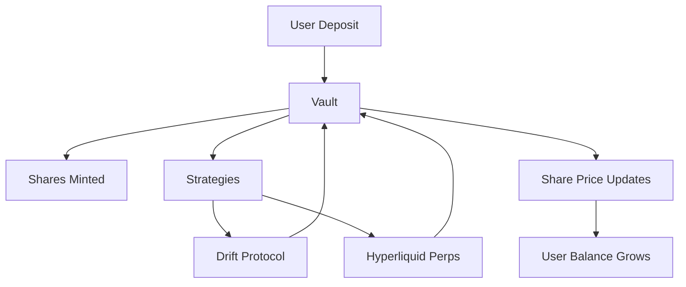

# Architecture

This document explains the high-level design of the vault system.

---

## 1. Flow of Funds

1. Users deposit assets (WBTC, USDC, etc.) into the vault
2. The vault issues **shares** representing ownership
3. Funds are allocated into strategies:
   - % goes into Drift (perps)
   - % into Hyperliquid (hedging / yield)
4. Performance (PnL) flows back to the vault → increases share price
5. Users can withdraw at any time by redeeming shares

---

## 2. Diagram

---

## 3. Withdrawals

- Users request a withdrawal by specifying how many shares to redeem
- Vault burns the shares and transfers the equivalent assets back
- The redemption value = shares × current_share_price
