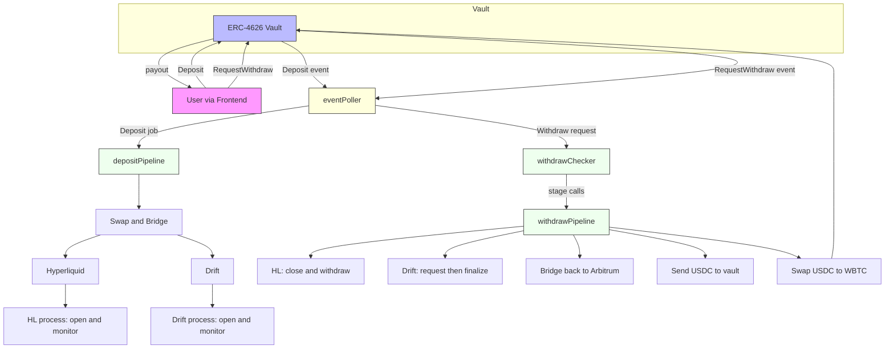

# Algostrats

**Algostrats** is a cross-chain algorithmic trading and vault management system. It combines on-chain vault logic (Arbitrum for now), bridging flows (wBTC → Solana), DeFi integrations (Uniswap, Drift protocol), and perpetual positions (Hyperliquid).

The system is designed to:

- Accept wBTC deposits into an ERC-4626 vault
- Dynamically split liquidity across multiple strategies
- Bridge funds to Solana via [LiFi](https://li.fi/)
- Open and manage positions on Drift (Solana perps) and Hyperliquid (off-chain perps exchange)
- Maintain risk-managed long/short exposure (e.g., long BTC, short SOL)
- Provide a unified frontend to monitor wallet, vault, and positions

---



<sub>Note: Mermaid can be picky with Unicode arrows and parentheses in node labels. This version uses ASCII-only labels.</sub>

---

## Components

### 1. Vault (`vault.sol`)

- ERC-4626 compliant vault for **wBTC** (8 decimals).
- Key features:
  - `setDepositCap(uint256 newCap)` → max global TVL cap
  - `setPerUserDepositCap(uint256 newCap)` → max per-user cumulative cap
  - `setDepositMin(uint256 newMin)` → min deposit per tx
  - `setSplitBPS(uint16 bps)` → rebalance split (e.g., 85/15 Drift vs Hyperliquid)
  - `setRebalanceMin(uint256 minAmount)` → min chunk size to rebalance
  - `pause()` / `unpause()` → circuit breaker
  - Safe rescue of tokens by owner

The vault issues **yWBTC shares** that represent user claims on the vault’s NAV.

---

### 2. Bridge to Solana (via LiFi)

- Keeper initiates bridge transactions using [LiFi SDK](https://li.fi/).
- Flow:
  1. Vault holds wBTC on Arbitrum
  2. Vault swaps wBTC for USDC on **Uniswap V3 / Universal Router**
  3. Keeper bridges USDC → Solana (via Wormhole/LiFi)
  4. Deposits bridged USDC into Drift Vault account

Example config:

```json
{
  "solanaRpc": "...",
  "driftVaultAddress": "...",
  "driftVaultAuthority": "...",
  "lifiApiKey": "..."
}
```

---

### 3. Swap on Uniswap

- Vault interacts with **Uniswap V3 / Universal Router** for token swaps (e.g., wBTC ↔ USDC).
- Used when adjusting exposure or preparing funds for bridging.
- Safety:
  - Slippage controlled via `amountOutMin`
  - Reverts on failed swap

Example:

```js
await swapExactTokensForTokens(
  WBTC,
  USDC,
  amountIn,
  amountOutMin,
  UNISWAP_ROUTER
);
```

---

### 4. Drift Protocol (Solana)

- Positions managed via Drift SDK (Node.js/TypeScript).
- Strategy: **Vault Position**
- Deposit bridged collateral (USDC) into vaults

Snapshot function (example):

```js
async function fetchDriftSnapshot() {
  const drift = await import("../tools/drift/read_position_info.mjs");
  return await drift.getPositions();
}
```

---

### 5. Hyperliquid

- Uses Hyperliquid Python SDK (REST/WebSocket).
- Strategy: **Perp Position**
  - Open **short SOL** perpetual
  - Open **long BTC** perpetual
  - Hedge vs Drift long BTC
- Keeper manages:
  - Order placement (`open_order.py`)
  - Cancel/modify orders
  - Leverage updates (`update_leverage`)
- Positions monitored via WebSocket feed.

---

## Strategy

The default allocation is:

- **85%** wBTC → Drift (long BTC perp)
- **15%** wBTC → Hyperliquid (short SOL perp)

This creates a **market-neutral, cross-chain strategy**:

- Captures directional spread between BTC and SOL
- Balances risk exposure across two protocols
- Dynamically rebalanced when vault TVL changes

---

## Frontend

React-based dashboard:

- **Wallet card** → shows user WBTC balance & vault shares
- **Vault card** → shows total TVL, split, and NAV
- **Drift card** → current perp position (long BTC)
- **Hyperliquid card** → current perp position (short SOL)

---

## Keeper Bot

Responsibilities:

1. Listen for deposits/withdraws from vault
2. Check if conditions for `rebalance()` are met
3. Execute bridge + swap + position updates
4. Monitor Drift and Hyperliquid positions
5. Auto-update frontend state via WebSocket

---

## Development Setup

### Prerequisites

- Node.js 18+
- Python 3.10+
- Hardhat (Solidity dev)
- Foundry (optional testing)
- Solana CLI + Drift SDK
- Hyperliquid SDK (Python)

### Install

```bash
git clone https://github.com/hwdeboer1977/algostrats
cd algostrats
npm install
```

### Environment

Create `.env` at project root:

```bash
ETH_RPC=https://arb1.arbitrum.io/rpc
PRIVATE_KEY=0x...

SOLANA_RPC=https://api.mainnet-beta.solana.com
DRIFT_VAULT_ADDRESS=...
DRIFT_VAULT_AUTHORITY=...

HYPERLIQUID_API_KEY=...
LIFI_API_KEY=...
```

---

## Testing

- **Vault** → Hardhat unit tests in `test/vault.test.js`
- **Bridging & Swaps** → Simulated with test RPC + Tenderly fork
- **Drift** → Use Solana devnet with test vault account
- **Hyperliquid** → Paper trading environment

---

## Roadmap

- [ ] Add management fees (deposit/withdraw)
- [ ] Add frontend position history view
- [ ] Implement dynamic split adjustment (volatility-based sigmoid)
- [ ] Full CI/CD pipeline with monitoring

---

## Disclaimer

This project is experimental. Do not use with real funds in production.
